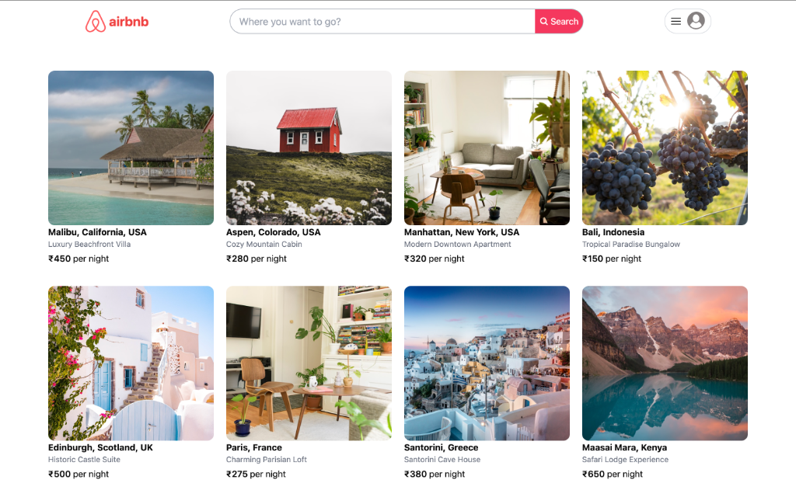
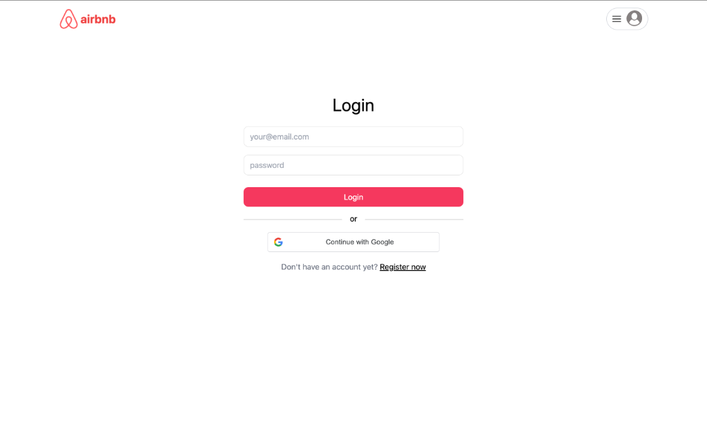

# 🏠 Airbnb Clone

A full-stack Airbnb clone built with React, Node.js, Express, and MongoDB. Features property listings, user authentication, booking system, and image uploads.



## ✨ Features

- **User Authentication** - Register, login with email/password or Google OAuth
- **Property Listings** - Browse, search, and filter vacation rentals
- **Property Details** - View photos, amenities, pricing, and availability
- **Booking System** - Book properties with date selection and guest count
- **Host Dashboard** - Add, edit, and manage your own property listings
- **Image Uploads** - Upload property photos via Cloudinary
- **Responsive Design** - Works seamlessly on desktop and mobile

## 📸 Screenshots

### Login Page


### Property Details


### Home Page with Listings


## 🛠️ Tech Stack

### Frontend
- **React 18** - UI library
- **Vite** - Build tool
- **TailwindCSS** - Styling
- **React Router** - Navigation
- **Axios** - HTTP client
- **React Toastify** - Notifications

### Backend
- **Node.js** - Runtime
- **Express.js** - Web framework
- **MongoDB** - Database
- **Mongoose** - ODM
- **JWT** - Authentication
- **Cloudinary** - Image storage
- **bcryptjs** - Password hashing

## 🚀 Getting Started

### Prerequisites
- Node.js (v18+)
- MongoDB Atlas account or local MongoDB
- Cloudinary account (for image uploads)
- Google OAuth credentials (optional)

### Installation

1. **Clone the repository**
   ```bash
   git clone https://github.com/skr-c0der/Airbnb-CLone.git
   cd Airbnb-CLone
   ```

2. **Setup Backend**
   ```bash
   cd api
   npm install
   ```

3. **Create `api/.env`**
   ```env
   DB_URL=your_mongodb_connection_string
   PORT=4000
   CLIENT_URL=http://localhost:5173
   COOKIE_TIME=30
   SESSION_SECRET=your_session_secret
   JWT_SECRET=your_jwt_secret
   JWT_EXPIRY=7d
   CLOUDINARY_NAME=your_cloudinary_name
   CLOUDINARY_API_KEY=your_cloudinary_key
   CLOUDINARY_API_SECRET=your_cloudinary_secret
   ```

4. **Setup Frontend**
   ```bash
   cd ../client
   npm install
   ```

5. **Create `client/.env`**
   ```env
   VITE_BASE_URL=http://localhost:4000
   VITE_GOOGLE_CLIENT_ID=your_google_client_id
   ```

6. **Seed Demo Data (Optional)**
   ```bash
   cd ../api
   node seed.js
   ```

7. **Run the Application**
   
   Terminal 1 (Backend):
   ```bash
   cd api
   npm start
   ```
   
   Terminal 2 (Frontend):
   ```bash
   cd client
   npm run dev
   ```

8. **Open in browser**
   ```
   http://localhost:5173
   ```

## 📁 Project Structure

```
airbnb-clone/
├── api/                    # Backend
│   ├── config/            # Database config
│   ├── controllers/       # Route handlers
│   ├── middlewares/       # Auth middleware
│   ├── models/            # Mongoose schemas
│   ├── routes/            # API routes
│   ├── utils/             # Helper functions
│   └── index.js           # Entry point
│
├── client/                 # Frontend
│   ├── public/            # Static assets
│   ├── src/
│   │   ├── components/    # Reusable components
│   │   ├── hooks/         # Custom hooks
│   │   ├── pages/         # Page components
│   │   └── utils/         # API client
│   └── index.html
│
└── screenshots/            # App screenshots
```

## 🔐 Demo Account

After seeding the database:
- **Email:** demo@airbnb.com
- **Password:** demo123456

## 📝 API Endpoints

| Method | Endpoint | Description |
|--------|----------|-------------|
| POST | `/api/register` | Register new user |
| POST | `/api/login` | User login |
| GET | `/api/places` | Get all places |
| GET | `/api/places/:id` | Get place by ID |
| POST | `/api/places` | Create new place |
| PUT | `/api/places/:id` | Update place |
| DELETE | `/api/places/:id` | Delete place |
| POST | `/api/bookings` | Create booking |
| GET | `/api/bookings` | Get user bookings |

## 🤝 Contributing

1. Fork the repository
2. Create a feature branch (`git checkout -b feature/amazing-feature`)
3. Commit changes (`git commit -m 'Add amazing feature'`)
4. Push to branch (`git push origin feature/amazing-feature`)
5. Open a Pull Request

## 📄 License

This project is open source and available under the [MIT License](LICENSE).

## 🙏 Acknowledgments

- [Airbnb](https://airbnb.com) for design inspiration
- [Unsplash](https://unsplash.com) for demo images
- [Rahul](https://github.com/rahul4019) for the original template

---

⭐ **Star this repo if you found it helpful!**
